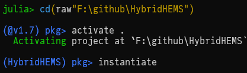

# A Hybrid Approach for Home Energy Management with Imitation Learning and Online Optimization

## Environment setup

The major part of our code is written in [Julia](https://julialang.org/) 1.7.0. The RL part is implemented with Python 3.9 and PyTorch.

After installing Julia 1.7, enter its REPL from this root directory and
type the following two commands:

- `]activate .` (activate the current environment)
- `instantiate` (install all dependencies of this project)

See the figure below, where we assume the root directory is *F:\github\HybridHEMS*.

As for the RL Python code, please refer to the separate repository [rl](.).

## File organization and how to run

- The implementation of the core functions including MILP and IL is provided in the HEMS package in *./src/HEMS*. All functions are documented in details.
- Jupyter notebooks in *./notebook* are executed to run different experiments with the above HEMS package. The notebooks can be run in [VS code](https://code.visualstudio.com/docs/datascience/jupyter-notebooks) or in a browser with [IJulia](https://github.com/JuliaLang/IJulia.jl).
  - Run *notebook\IL\IL_data.ipynb* to generate the expert data.
  - Run *notebook\IL\BC_shiftable.ipynb* to train the DNN agents for shiftable loads via IL based on the above expert data.
  - Run *notebook\IL\inspection.ipynb* to inspect characteristics of the algorithms as shown in the paper.
  - Run *notebook\RL\convergence.ipynb* to draw the convergence curves of RL based on the data produced in Python.
  - Run *notebook\performance_comparison.ipynb* to benchmark the performance of different methods for comparison.
- The home configuration and scenario data are stored in the *./data* directory.
- The other directories contain intermediate images, data, and models etc.
